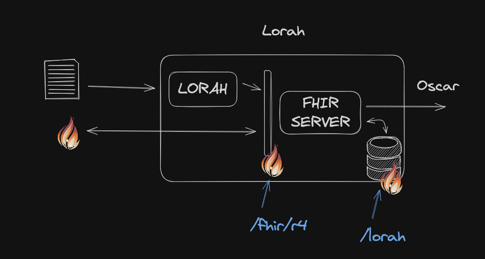
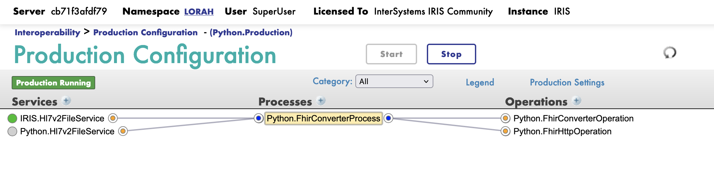
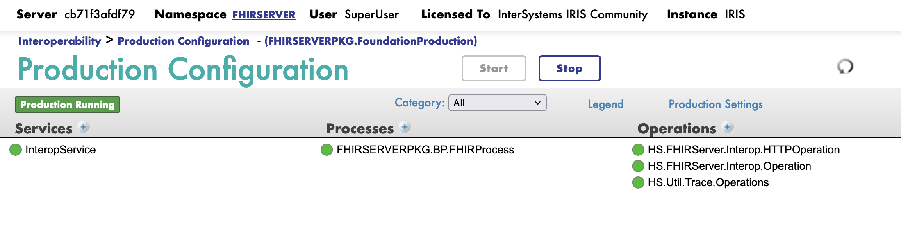

# 1. Lorah

Lorah est un moteur d'intégration qui a pour but de transformer les données de santé en messages HL7 FHIR.

Ce document décrit l'architecture et l'implémentation de Lorah.

- [1. Lorah](#1-lorah)
- [2. Introduction](#2-introduction)
- [3. EAI](#3-eai)
  - [3.1. Architecture](#31-architecture)
  - [3.2. Python.FhirHttpOperation](#32-pythonfhirhttpoperation)
  - [3.3. Python.FhirConverterOperation](#33-pythonfhirconverteroperation)
  - [3.4. Python.FhirConverterProcess](#34-pythonfhirconverterprocess)
  - [3.5. IRIS.Hl7v2FileService](#35-irishl7v2fileservice)
  - [3.6. Python.Hl7v2FileService](#36-pythonhl7v2fileservice)
  - [3.7. Tests](#37-tests)
  - [3.8. Déploiement](#38-déploiement)
- [4. Templates de conversion](#4-templates-de-conversion)
  - [4.1. Tests](#41-tests)
  - [4.2. Déploiement](#42-déploiement)
- [5. FHIR Façade](#5-fhir-façade)
  - [5.1. Architecture](#51-architecture)
  - [5.2. InteropService](#52-interopservice)
  - [5.3. FHIRSERVERPKG.BP.FHIRProcess](#53-fhirserverpkgbpfhirprocess)
  - [5.4. HS.FHIRServer.Interop.HTTPOperation](#54-hsfhirserverinterophttpoperation)
  - [5.5. HS.FHIRServer.Interop.Operation](#55-hsfhirserverinteropoperation)
  - [5.6. HS.Util.Trace.Operations](#56-hsutiltraceoperations)
  - [5.7. Tests](#57-tests)
  - [5.8. Déploiement](#58-déploiement)
- [6. Repository FHIR](#6-repository-fhir)
  - [6.1. Tests](#61-tests)
  - [6.2. Déploiement](#62-déploiement)
- [7. Déploiement](#7-déploiement)


# 2. Introduction

Ce document décrit l'implementation de lorah. Lorah est composé de quatres modules:

- EAI : un moteur d'intégration qui a pour but de transformer les données de santé en messages HL7 FHIR.
- FHIR Façade : un proxy du serveur FHIR qui a pour but de : 
  - transmettre les messages HL7 FHIR au serveur FHIR.
  - filtre les messages HL7 FHIR et les transmettre à Oscar.
- Repository FHIR : un module qui a pour but de stocker les messages HL7 FHIR.
- Templates de conversion : un module qui a pour but de définir les templates de conversion des données de santé en messages HL7 FHIR.



# 3. EAI

Lorah EAI est un moteur d'intégration qui a pour but de transformer les données de santé en messages HL7 FHIR.

> [!NOTE]
> Ce livrable est une première version de l'EAI. Il est possible que des modifications soient apportées.
> Seul les entrées de type HL7v2 sont supportées.
> Les conventions de nommage des composants de la production ne sont pas respectées.

## 3.1. Architecture

Ci-dessous l'architecture de l'EAI:



Cette production est dans le namespace `LORAH`.

Le code source est dans le répertoire `src/python/fhir-converter`.

Les composants sont les suivants:

- `Python.FhirHttpOperation` : un composant qui permet de faire des appels HTTP.
- `Python.FhirConverterOperation` : un composant qui permet de convertir les données de santé en messages HL7 FHIR.
- `Python.FhirConverterProcess` : process principal qui orchestre les composants.
- `IRIS.Hl7v2FileService` : un composant qui permet de lire les messages HL7v2 à partir d'un fichier implémenté en ObjectScript.
- `Python.Hl7v2FileService` : un composant qui permet de lire les messages HL7v2 à partir d'un fichier implémenté en Python.

## 3.2. Python.FhirHttpOperation

Ce composant permet de faire des appels HTTP.

Il est implémenté en Python.

Il reçoit en entrée un message python avec le format suivant:

```python
@dataclass
class FhirRequest(Message):
    url: str
    resource: str
    method: str
    data: str
    headers: dict
```

Il retourne un message python avec le format suivant:

```python
@dataclass
class FhirResponse(Message):
    status_code: int
    content: str
    headers: dict
    resource: str
```

Il se base sur la librairie `requests`.

A son initialisation, il cree une session à partir de l'url fournie dans la variable de production `url`.

Le mecansime d'authentification est basique. Il utilise en dur des tuples `username` et `password` grace à la méthode `_get_credentials`.

L'appel HTTP par la librairie `requests` est construit à partir des paramètres fournis dans le message d'entrée.

> [!NOTE]
> Il n'y a pas de gestion des erreurs.
> Si l'appel HTTP échoue, le résultat est retourné dans le message de sortie.

## 3.3. Python.FhirConverterOperation

Ce composant permet de convertir les données de santé en messages HL7 FHIR.

Il est implémenté en Python.

Il reçoit en entrée un message python avec le format suivant:

```python
@dataclass
class FhirConverterMessage(Message):
    input_filename: str
    input_data: str
    input_data_type: str
    root_template: str
```

Il retourne un message python avec le format suivant:

```python
@dataclass
class FhirConverterResponse(Message):
    status: str
    output_data: str
    output_filename: str
```

Il se base sur la librairie `fhir-converter` disponible à l'adresse suivante: [fhir-converter](https://github.com/grongierisc/fhir-converter/) pour effectuer la conversion.

A son initialisation, il se charge creer un nouveau render de type `Hl7v2Renderer` avec comme template par défaut `template_path` qui est une variable de production.

`on_fhir_converter_message` est la méthode principale qui permet de convertir les données de santé en messages HL7 FHIR.

## 3.4. Python.FhirConverterProcess

Ce process est le process principal qui orchestre les composants.

Il est implémenté en Python.

Il reçoit en entrée deux types de message :

- `iris.EnsLib.HL7.Message` : un message HL7v2 en objectscript.
- `FhirConverterMessage` : un message python.

Format du message de type `FhirConverterMessage`:

```python
@dataclass
class FhirConverterMessage(Message):
    input_filename: str
    input_data: str
    input_data_type: str
    root_template: str
```

Si le message est de type `iris.EnsLib.HL7.Message`, il le convertit en message python de type `FhirConverterMessage` et le transmet à la méthode `on_fhir_converter_message`.

Cette méthode ne retourne pas de message.

Cette méthode initialise le `root_template` par une valeur par défaut qui est `ADT_CUSTOM`.

L'action suivant est de transmettre le message python de type `FhirConverterMessage` au composant `Python.FhirConverterOperation`.

Le résultat est transmis au composant `Python.FhirHttpOperation` avec les valeurs par défaut suivantes:

- `url` : `http://localhost:52773/`
- `resource` : `fhir/r4`
- `method` : `POST`
- `headers` : `{'Content-Type': 'application/fhir+json'}`
- `data` : le résultat de la conversion.

Ces valeurs par défaut définissent le serveur FHIR Façade.

## 3.5. IRIS.Hl7v2FileService

Ce composant permet de lire les messages HL7v2 à partir d'un fichier implémenté en ObjectScript.

Transmettre un message de type `EnsLib.HL7.Message` au composant `Python.FhirConverterProcess`.

## 3.6. Python.Hl7v2FileService

Ce composant permet de lire les messages HL7v2 à partir d'un fichier implémenté en Python.

Il est implémenté en Python.

Transmettre un message de type `FhirConverterMessage` au composant `Python.FhirConverterProcess`.

## 3.7. Tests

> [!TODO]
> Implémenter les tests "fonctionnels" de l'EAI.
> une série de tests unitaires ont été implémentés dans le répertoire `src/python/fhir-converter/tests`.

## 3.8. Déploiement

> [!WARNING]
> Du fait du choix d'architecture Git, ce composant ne peut etre déployé qu'avec la partie FHIR Façade ainsi que les templates de conversion.
> Cf : Déploiement à la fin du document.

# 4. Templates de conversion

Ce module a pour but de définir les templates de conversion des données de santé en messages HL7 FHIR.

Ces templates sont stockés dans le répertoire `templates`.

Ces templates sont utilisés par le composant `Python.FhirConverterOperation` pour effectuer la conversion et configuré avec la variable de production `template_path`.

## 4.1. Tests

## 4.2. Déploiement

> [!NOTE]
> Il est recommandé de creer un git dédié pour les templates de conversion avec sa propre CI/CD.

# 5. FHIR Façade

Lorah FHIR Façade est un proxy du serveur FHIR qui a pour but de :

- transmettre les messages HL7 FHIR au serveur FHIR.
- filtre les messages HL7 FHIR et les transmettre à Oscar.

Le code source est dans le répertoire `src/cls/FHIRSERVERPKG`.

Il est déployé dans le namespace `FHIRSERVER` qui est aussi le même namespace que le serveur FHIR.

Le code est en ObjectScript.

## 5.1. Architecture

Ci-dessous l'architecture de la FHIR Façade:



Les composants sont les suivants:

- `InteropService` : Point d'entrée de la FHIR Façade.
- `FHIRSERVERPKG.BP.FHIRProcess` : Process principal qui orchestre les composants.
- `HS.FHIRServer.Interop.HTTPOperation` : Composant qui permet de faire des appels HTTP.
- `HS.FHIRServer.Interop.Operation` : Composant qui communique avec le serveur FHIR local.
- `HS.Util.Trace.Operations` : Composant qui permet de tracer les messages.

## 5.2. InteropService

Point d'entrée de la FHIR Façade.

Il est implémenté en ObjectScript.

Il creer des messages de type `HS.FHIRServer.Interop.Request` à partir des messages HL7 FHIR reçus.

Il transmet ces messages au composant `FHIRSERVERPKG.BP.FHIRProcess`.

## 5.3. FHIRSERVERPKG.BP.FHIRProcess

Process principal qui orchestre les composants.

Il est implémenté en ObjectScript.

Il reçoit en entrée un message de type `HS.FHIRServer.Interop.Request` et retourne un message de type `HS.FHIRServer.Interop.Response`.

Il transmet le message reçu au composant `HS.FHIRServer.Interop.Operation` en surchargeant la variable `Request.SessionApplication` avec la valeur par défaut `/lorah`.

La réponse de `HS.FHIRServer.Interop.Operation` est transmise à `InteropService`.

L'appel à `HS.FHIRServer.Interop.HTTPOperation` est conditionné par a variable `whatever` qui est à `true`.

Cette variable peut permettre de conditionner l'appel HTTP et donc gérer le **consentement**.

Les requêtes HTTP ne bloquent pas le process et sont effectuées de manière asynchrone.

## 5.4. HS.FHIRServer.Interop.HTTPOperation

Composant qui permet de faire des appels HTTP.

Il est implémenté en ObjectScript.

Il est configuré avec le registry HealthShare.

Sa configuration est la suivante:

```objectscript
    set service = #class(HS.Registry.Service.HTTP).%New()
    set service.Name = "oscar"
    set service.URL = "/fhir/r4/"
    set service.Host = "oscar"
    set service.Port = 52773
    set service.Type = "HTTP"
    do service.%Save()
```

Elle se trouve dans le fichier `iris.script`.

## 5.5. HS.FHIRServer.Interop.Operation

Composant qui communique avec le serveur FHIR local.

Il est implémenté en ObjectScript.

Aucune configuration n'est nécessaire.

## 5.6. HS.Util.Trace.Operations

Composant qui permet de tracer les messages.

Il est implémenté en ObjectScript.

Aucune configuration n'est nécessaire.

## 5.7. Tests

> [!TODO]
> Implémenter les tests "fonctionnels" de la FHIR Façade.

## 5.8. Déploiement

Comme indiqué précédemment, le déploiement de la FHIR Façade est lié à l'EAI et aux templates de conversion.

Cf : Déploiement à la fin du document.

# 6. Repository FHIR

Ce module a pour but de stocker les messages HL7 FHIR.

Il est déployé dans le namespace `FHIRSERVER` qui est aussi le même namespace que le FHIR Façade.

Le code est en ObjectScript.

Sa configuration est la suivante:

```objectscript
    Set appKey = "/lorah"
    Set strategyClass = "HS.FHIRServer.Storage.Json.InteractionsStrategy"
    Set metadataConfigKey = "HL7v40"
        Do #class(HS.FHIRServer.Installer).InstallInstance(appKey, strategyClass, metadataConfigKey,"",0)
```

Elle se trouve dans le fichier `iris.script`.

## 6.1. Tests

> [!TODO]
> Implémenter les tests "fonctionnels" du Repository FHIR.

## 6.2. Déploiement

Comme indiqué précédemment, le déploiement du Repository FHIR est lié à l'EAI et aux templates de conversion.
Cependant, il est déployé une seule fois et ne nécessite pas de mise à jour.

Cf : Déploiement à la fin du document.

# 7. Déploiement

Le choix de déploiement est basé sur des scripts de CI/CD par rapport à Gitlab.

Trois stages sont définis:

- test
- deploy-integration
- deploy-production

Le stage test est déclenché à chaque push sur la branche `master`.

Le stage deploy-integration est déclenché à chaque tag sur la branche `master`.

Le stage deploy-production est déclenché à chaque release sur la branche `master`.

Les scripts de CI/CD sont dans le fichier `.gitlab-ci.yml`.

Le choix est de déployer l'ensemble des composants en même temps.

Exemple de script de CI/CD:

```yaml

stages:
  - test
  - deploy_integration
  - deploy_production

variables:
  # define the image to use
  IMAGE: intersystemsdc/irishealth-community:latest
  IRISNAMESPACE_EAI: "LORAH"
  IRISNAMESPACE_FHIR: "FHIRSERVER"
  DOCKER_INSTANCE: "lorah"
  HOST_INTERGRATION: "lorah-integ"
  USER_INTERGRATION: "root"

test:
  # use an docker executor
  stage: test
  image: intersystemsdc/irishealth-community:latest
  before_script:
    - iris start IRIS
    - iris session IRIS < iris.script
    - export IRISNAMESPACE=$IRISNAMESPACE
  script:
    - pip install -r requirements.txt
    - pytest
  tags:
    - docker

deploy_integration:
  stage: deploy_integration
  rules:
    - if: '$CI_COMMIT_TAG'
  script:
    - echo "Deploying tag $CI_COMMIT_TAG"
    # scp file to integration server
    - scp . $USER_INTERGRATION@$HOST_INTERGRATION:/home/$USER_INTERGRATION
    # ssh to integration server
    - ssh $USER_INTERGRATION@$HOST_INTERGRATION -t "
        cd /home/$USER_INTERGRATION &&
        docker-compose exec $DOCKER_INSTANCE bash -c '
          iop --migrate /irisdev/app/src/python/fhir-converter/settings.py &&
          iop --restart &&
          iris session IRIS < /irisdev/app/iris.deploy.script'"
  tags:
    - shell

deploy_production:
  stage: deploy_production
  rules:
    - if: '$CI_COMMIT_RELEASE'
  script:
    - echo "Deploying release"
    - uname -a
  tags:
    - shell
```
