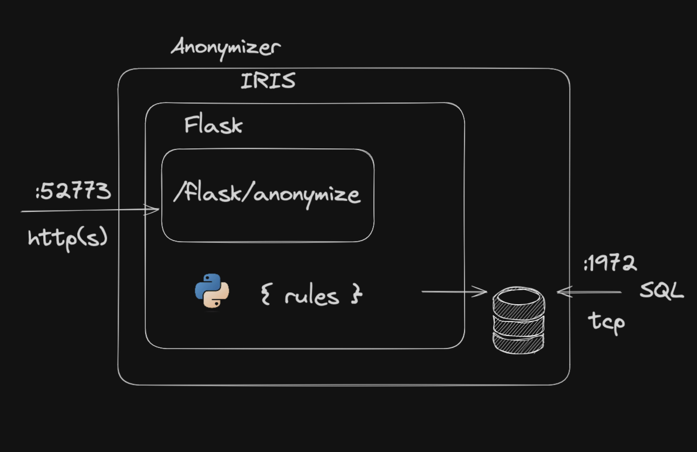

# 1. Anonymizer

Ceci est un projet qui a pour but de permettre l'anonymisation de données de type FHIR et de stocker les correspondances entre les données originales et les données anonymisées.

- [1. Anonymizer](#1-anonymizer)
  - [1.1. Architecture](#11-architecture)
    - [1.1.1. Application web](#111-application-web)
    - [1.1.2. Service de stockage SQL](#112-service-de-stockage-sql)
    - [1.1.3. Règles d'anonymisation](#113-règles-danonymisation)
    - [1.1.4. Spécifications Fonctionnelles](#114-spécifications-fonctionnelles)
    - [1.1.5. Spécifications Techniques](#115-spécifications-techniques)
    - [1.1.6. Définir les règles d'anonymisation](#116-définir-les-règles-danonymisation)
      - [1.1.6.1. hash](#1161-hash)
      - [1.1.6.2. mask](#1162-mask)
      - [1.1.6.3. birth\_date\_shift](#1163-birth_date_shift)
      - [1.1.6.4. date\_shift](#1164-date_shift)
      - [1.1.6.5. keep](#1165-keep)
    - [1.1.7. Implémentation](#117-implémentation)
    - [1.1.8. Tests](#118-tests)
      - [1.1.8.1. Test fonctionnel](#1181-test-fonctionnel)
        - [1.1.8.1.1. Patient](#11811-patient)
        - [1.1.8.1.2. Encounter](#11812-encounter)
        - [1.1.8.1.3. Practitioner](#11813-practitioner)


## 1.1. Architecture

L'architecture du projet est la suivante :



Le projet est composé de 3 services :

- Une application web implémentée avec le micro-framework Flask qui permet de poster des données FHIR et de les anonymiser.
- Un service de stockage SQL qui permet de stocker les correspondances entre les données originales et les données anonymisées.
- Des règles d'anonymisation qui permettent de définir comment les données doivent être anonymisées.

### 1.1.1. Application web

L'application web est une API REST qui permet de poster des données FHIR et de les anonymiser. Elle est implémentée avec le micro-framework Flask.

A date, l'application n'implémente qu'une seule route :

- `POST /anonymize` : Permet de poster des données FHIR et de les anonymiser.

Cette route est exposée sur le server iris sous le path '/flask'.

L'url complète pour accéder à la route est donc : `http://iris:52773/flask/anonymize`.

> [!NOTE]
> Le port 52773 est sujet à changement. Pour connaître le port exact, il faut regarder le fichier `docker-compose.yml`.

### 1.1.2. Service de stockage SQL

Le service de stockage est défini par un modèle SQLAlchemy :

```python
class AnonymizedIdentifiable(db.Model):
    __tablename__ = 'anonymized_identifiable'

    # id primary key with autoincrement
    id = db.Column(db.Integer, primary_key=True)
    # resource_type with a maximum length of 255 characters
    resource_type = db.Column(db.String(255))
    # resource_id with a maximum length of 255 characters
    resource_id = db.Column(db.String(255))
    # resource_id_anonymized with a maximum length of 255 characters
    resource_id_anonymized = db.Column(db.String(255))
    # create a unique constraint on resource_type and resource_id
    __table_args__ = (db.UniqueConstraint('resource_type', 'resource_id'),)
```

L'application flask effectue un upsert sur la table `anonymized_identifiable` pour stocker les correspondances entre les données originales et les données anonymisées.

```python
with db.session() as session:
    if session.query(AnonymizedIdentifiable).filter_by(resource_id=anonymized_identifiable.resource_id, resource_type = resource.get('resourceType')).first() is None:
        session.add(anonymized_identifiable)
    else:
        session.query(AnonymizedIdentifiable).filter_by(resource_id=anonymized_identifiable.resource_id, resource_type = resource.get('resourceType')).update({'resource_id_anonymized': anonymized_identifiable.resource_id_anonymized})
    session.commit()
```

Ce modèle est versionné par `alembic` et est stocké dans le dossier `migrations`.

Les migrations sont appliquées automatiquement au démarrage du service.

app.py
```python
alembic = Alembic(
    metadatas={
        "default": AnonymizedIdentifiable.metadata,
    },
)

app = Flask(__name__)
app.config['SQLALCHEMY_DATABASE_URI'] = 'iris+emb://IRISAPP'
app.app_context().push()

db.init_app(app)
alembic.init_app(app)
alembic.upgrade()
```

> [!NOTE]
> Le system de migration peut etre sujet à changement. 
> Une evolution possible serait de mettre en place un systeme de migration automatique à partir de scripts python.

### 1.1.3. Règles d'anonymisation

### 1.1.4. Spécifications Fonctionnelles

Ci dessous les règles d'anonymisation demandées par le client :

| SECTION                         | DONNÉE                                                        | ACTION DE-ID                                      |
|----------------------------------|---------------------------------------------------------------|---------------------------------------------------|
| **PATIENT**                      | Identifiants (IPP, INS ...)                                    | Pseudonymiser                                     |
|                                  | Prénom                                                        | Supprimer                                         |
|                                  | Nom                                                           | Supprimer                                         |
|                                  | Date de Naissance                                              | Décaler au 31/12 de l’année précédente la date de naissance |
|                                  | Adresse                                                       | Supprimer et conserver que le Code Pays et le Code Postal |
| **CONTACT INFO / PERSONNE DE CONFIANCE** | Email, Numéro de téléphone                                    | Supprimer                                         |
| **ENCOUNTER (SÉJOUR)**           | Numéro de séjour                                               | Pseudonymiser                                     |
|                                  | Date de début de séjour                                        | Rapporter à 1 jour avant                          |
|                                  | Date de fin de séjour                                          | Rapporter à 1 jour avant                          |
| **PRATICIEN**                    | Numéro RPPS                                                    | Pseudonymiser                                     |
|                                  | Nom, prénom                                                    | Supprimer                                         |
| **NUMÉRO CLÉS**                  | Numéro d’identifiant permanent du patient (IPP)                | Pseudonymiser                                     |
|                                  | Numéro d’identification au répertoire des personnes physiques  | Pseudonymiser                                     |
| **DÉCÈS**                        | Date                                                          | À conserver                                       |
|                                  | Lieu                                                          | À conserver                                       |
|                                  | Cause du décès                                                 | À conserver                                       |
| **IDENTITÉ**                     | Sexe                                                          | À conserver                                       |
|                                  | Genre                                                         | À conserver                                       |
|                                  | Civilité                                                      | Supprimer                                         |
| **STATUT MATRIMONIAL**           |                                                               | À conserver                                       |

### 1.1.5. Spécifications Techniques

A partir des spécifications fonctionnelles ci dessus, voici le tableau avec :

- nom de la resource fhir
- les fhirpath correspondants
- functions de de-identification à appliquer

| Section | Donnée | Resource FHIR | FHIRPath | De-ID Function |
|---------|--------|---------------|----------|----------------|
| PATIENT | Identifiants (IPP, INS ...) | Patient | `$.identifier[*].value` | `hash` |
|  | Prénom | Patient | `$.name[*].given` | `mask` |
|  | Nom | Patient | `$.name[*].family` | `mask` |
|  | Date de Naissance | Patient | `$.birthDate` | `birth_date_shift` |
|  | Adresse | Patient | `$.address[*]` | `mask` |
| CONTACT INFO / PERSONNE DE CONFIANCE | Email, Numéro de téléphone | RelatedPerson | `$.telecom[*].value` | `mask` |
| ENCOUNTER (SÉJOUR) | Numéro de séjour | Encounter | `$.identifier[*].value` | `hash` |
|  | Date de début de séjour | Encounter | `$.period.start` | `date_shift` |
|  | Date de fin de séjour | Encounter | `$.period.end` | `date_shift` |
| PRATICIEN | Numéro RPPS | Practitioner | `$.identifier[*].value` | `hash` |
|  | Nom, prénom | Practitioner | `$.name[*].given` | `mask` |
| NUMÉRO CLÉS | Numéro d’identifiant permanent du patient (IPP) | Patient | `$.identifier[*].value` | `hash` |
|  | Numéro d’identification au répertoire des personnes physiques | Patient | `$.identifier[*].value` | `hash` |
| DÉCÈS | Date | Patient | `$.death-date` | `keep` |
|  | Lieu | **??** | **??**  | `keep` |
|  | Cause du décès | **??**  | **??** |  `keep` |
| IDENTITÉ | Sexe | Patient | `$.gender` | `keep` |
|  | Genre | Patient | `$.gender` | `keep` |
|  | Civilité | Patient | `$.name[*].prefix` | `mask` |
| STATUT MATRIMONIAL |  | Patient | `$.maritalStatus` | `keep` |

> [!WARNING]
> Je ne sais pas interpréter les données de la colonne `Lieu` et `Cause du décès`. Il faudra les compléter.

### 1.1.6. Définir les règles d'anonymisation

#### 1.1.6.1. hash

La fonction `hash` permet de pseudonymiser les données en utilisant une fonction de hashage.

```python
def hash():
    return lambda x,y,z: hashlib.sha256(x.encode()).hexdigest()
```

#### 1.1.6.2. mask

La fonction `mask` permet de masquer les données en les remplaçant par des étoiles.
Si la valeur est non null, la fonction retourne la valeur.

```python
def mask(value):
    if value is None:
        return lambda x,y,z: '*' * len(x)
    else:
        return value
```

#### 1.1.6.3. birth_date_shift

La fonction `birth_date_shift` permet de décaler la date de naissance au 31/12 de l'année précédente.

```python
def birth_date_shift():
    return lambda x,y,z: f"{str(int(x[:4])-1)}-12-31"
```

#### 1.1.6.4. date_shift

La fonction `date_shift` permet de décaler la date d'un jour.

```python
def date_shift():
    return lambda x,y,z: (datetime.strptime(x, '%Y-%m-%d') - timedelta(days=1)).strftime('%Y-%m-%d')
```

#### 1.1.6.5. keep

Fonction par défaut qui permet de conserver les données.

```python
def keep():
    return lambda x,y,z: x
```

### 1.1.7. Implémentation

> [!TODO]
> Implémenter les règles d'anonymisation.

Les règles d'anonymisation sont implémentées dans le fichier `anonymizer.py`.

> [!NOTE]
> Le fichier `anonymizer.py` est un exemple. Il est possible de le modifier pour ajouter des règles d'anonymisation supplémentaires.

```python
def anonymize(resource):
    rules = {
        'Patient': {
            '$.identifier[*].value': hash(),
            '$.name[*].given': mask(),
            '$.name[*].family': mask(),
            '$.birthDate': birth_date_shift(),
            '$.address[*]': mask(),
            '$.telecom[*].value': mask(),
            '$.maritalStatus': keep
        },
        'Encounter': {
            '$.identifier[*].value': hash(),
            '$.period.start': date_shift(),
            '$.period.end': date_shift()
        },
        'Practitioner': {
            '$.identifier[*].value': hash(),
            '$.name[*].given': mask()
        },
        'Death': {
            '$.deceasedDateTime': keep,
            '$.address': keep,
            '$.cause[*].condition': keep
        }
    }
```

### 1.1.8. Tests

> [!TODO]
> Ajouter des tests unitaires pour vérifier que les données sont bien anonymisées.

#### 1.1.8.1. Test fonctionnel

> [!NOTE]
> Ces exemples sont des exemples de données FHIR. Ils ne sont pas exhaustifs et n'ont pas été testés.

##### 1.1.8.1.1. Patient 

Soit le payload suivant :

```json
{
    "resourceType": "Patient",
    "identifier": [
        {
            "value": "123456"
        }
    ],
    "name": [
        {
            "given": "John",
            "family": "Doe"
        }
    ],
    "birthDate": "1980-01-01",
    "address": [
        {
            "line": [
                "123 Main St"
            ],
            "city": "Springfield",
            "state": "IL",
            "postalCode": "62701",
            "country": "USA"
        }
    ],
    "telecom": [
        {
            "system": "email",
            "value": "toto@toto.com"
        },
        {
            "system": "phone",
            "value": "123-456-7890"
        }
    ],
    "maritalStatus": {
        "coding": [
            {
                "code": "M",
                "display": "Married"
            }
        ]
    }
}
```

Le payload anonymisé devrait être :

```json
{
    "resourceType": "Patient",
    "identifier": [
        {
            "value": "f7b3b9"
        }
    ],
    "name": [
        {
            "given": "********",
            "family": "********"
        }
    ],
    "birthDate": "1979-12-31",
    "address": [
        {
            "line": [
                "********"
            ],
            "city": "******",
            "state": "**",
            "postalCode": "*****",
            "country": "***"
        }
    ],
    "telecom": [
        {
            "system": "email",
            "value": "********"
        },
        {
            "system": "phone",
            "value": "********"
        }
    ],
    "maritalStatus": {
        "coding": [
            {
                "code": "M",
                "display": "Married"
            }
        ]
    }
}
```

##### 1.1.8.1.2. Encounter

Soit le payload suivant :

```json
{
    "resourceType": "Encounter",
    "identifier": [
        {
            "value": "123456"
        }
    ],
    "period": {
        "start": "2021-01-01",
        "end": "2021-01-02"
    }
}
```

Le payload anonymisé devrait être :

```json
{
    "resourceType": "Encounter",
    "identifier": [
        {
            "value": "f7b3b9"
        }
    ],
    "period": {
        "start": "2020-12-31",
        "end": "2020-12-31"
    }
}
```

##### 1.1.8.1.3. Practitioner

Soit le payload suivant :

```json
{
    "resourceType": "Practitioner",
    "identifier": [
        {
            "value": "123456"
        }
    ],
    "name": [
        {
            "given": "John",
            "family": "Doe"
        }
    ]
}
```

Le payload anonymisé devrait être :

```json
{
    "resourceType": "Practitioner",
    "identifier": [
        {
            "value": "f7b3b9"
        }
    ],
    "name": [
        {
            "given": "********",
            "family": "********"
        }
    ]
}
```

