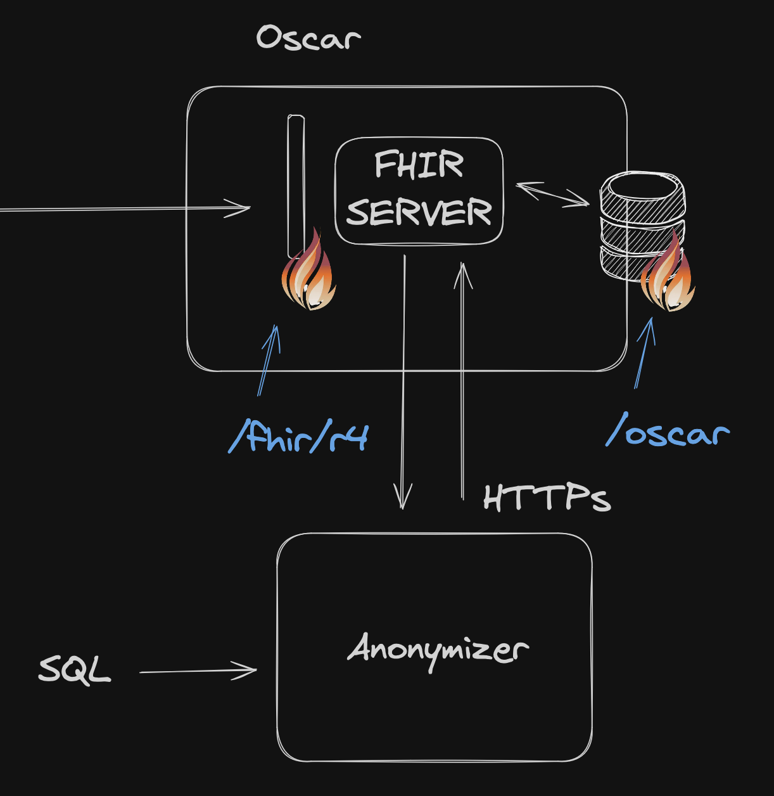
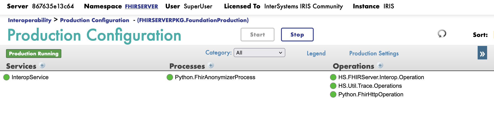

# 1. Oscar

Oscar est la version du server FHIR pour les données de santé anonymisées.

- [1. Oscar](#1-oscar)
  - [1.1. Architecture](#11-architecture)
  - [1.2. FHIR Façade](#12-fhir-façade)
    - [1.2.1. Architecture](#121-architecture)
    - [1.2.2. InteropService](#122-interopservice)
    - [1.2.3. Python.FhirAnonymizerProcess](#123-pythonfhiranonymizerprocess)
    - [1.2.4. Python.FhirHttpOperation](#124-pythonfhirhttpoperation)
    - [1.2.5. HS.FHIRServer.Interop.Operation](#125-hsfhirserverinteropoperation)
    - [1.2.6. HS.Util.Trace.Operations](#126-hsutiltraceoperations)
    - [1.2.7. Tests](#127-tests)
  - [1.3. Repository FHIR](#13-repository-fhir)
    - [1.3.1. Tests](#131-tests)
  - [1.4. Déploiement](#14-déploiement)


## 1.1. Architecture

Ci-dessous l'architecture d'Oscar:



Cette architecture est composée de 2 parties:

- Une entrée en FHIR Façade
- Un serveur FHIR

## 1.2. FHIR Façade

Oscar FHIR Façade est un proxy du serveur FHIR qui a pour but de :

- transmettre les messages HL7 FHIR au serveur FHIR.
- anonymiser les messages HL7 FHIR si ils contiennent des données.

### 1.2.1. Architecture

Ci-dessous l'architecture de la FHIR Façade:



Cette production est composée de 5 composants:

- `InteropService` : Point d'entrée de la FHIR Façade.
- `Python.FhirAnonymizerProcess` : Process qui anonymise les messages HL7 FHIR.
- `Python.FhirHttpOperation` : Composant qui permet de faire des appels HTTP.
- `HS.FHIRServer.Interop.Operation` : Composant qui communique avec le serveur FHIR local.
- `HS.Util.Trace.Operations` : Composant qui permet de tracer les messages.

### 1.2.2. InteropService

Point d'entrée de la FHIR Façade.

Il est implémenté en ObjectScript.

Il creer des messages de type `HS.FHIRServer.Interop.Request` à partir des messages HL7 FHIR reçus.

Il transmet ces messages au composant `FHIRSERVERPKG.BP.FHIRProcess`.

### 1.2.3. Python.FhirAnonymizerProcess

Process qui anonymise les messages HL7 FHIR.

Il est implémenté en Python.

Le code source est dans le répertoire `src/python/oscar/bp.py`.

Si le message d'entrée contient des données, il les anonymise en invoquant le composant `Python.FhirHttpOperation` avec les paramètres suivants:

- `url` : http://anonymizer:52773/flask/
- `resource` : anonymize
- `data` : message HL7 FHIR
- `headers` : `{'Content-Type': 'application/json'}`
- `method` : POST

Il retourne le message anonymisé qui est transmis au composant `HS.FHIRServer.Interop.Operation` en surchargeant la variable `Request.SessionApplication` avec la valeur par défaut `/oscar`.

### 1.2.4. Python.FhirHttpOperation

Ce composant permet de faire des appels HTTP.

Il est implémenté en Python.

Il reçoit en entrée un message python avec le format suivant:

```python
@dataclass
class FhirRequest(Message):
    url: str
    resource: str
    method: str
    data: str
    headers: dict
```

Il retourne un message python avec le format suivant:

```python
@dataclass
class FhirResponse(Message):
    status_code: int
    content: str
    headers: dict
    resource: str
```

Il se base sur la librairie `requests`.

A son initialisation, il cree une session à partir de l'url fournie dans la variable de production `url`.

Le mecansime d'authentification est basique. Il utilise en dur des tuples `username` et `password` grace à la méthode `_get_credentials`.

L'appel HTTP par la librairie `requests` est construit à partir des paramètres fournis dans le message d'entrée.

> [!NOTE]
> Il n'y a pas de gestion des erreurs.
> Si l'appel HTTP échoue, le résultat est retourné dans le message de sortie.

### 1.2.5. HS.FHIRServer.Interop.Operation

Composant qui communique avec le serveur FHIR local.

Il est implémenté en ObjectScript.

Aucune configuration n'est nécessaire.

### 1.2.6. HS.Util.Trace.Operations

Composant qui permet de tracer les messages.

Il est implémenté en ObjectScript.

Aucune configuration n'est nécessaire.

### 1.2.7. Tests

> [!TODO]
> Implémenter les tests "fonctionnels" de la FHIR Façade.

## 1.3. Repository FHIR

Ce module a pour but de stocker les messages HL7 FHIR.

Il est déployé dans le namespace `FHIRSERVER` qui est aussi le même namespace que le FHIR Façade.

Le code est en ObjectScript.

Sa configuration est la suivante:

```objectscript
    Set appKey = "/oscar"
    Set strategyClass = "HS.FHIRServer.Storage.Json.InteractionsStrategy"
    Set metadataConfigKey = "HL7v40"
        Do #class(HS.FHIRServer.Installer).InstallInstance(appKey, strategyClass, metadataConfigKey,"",0)
```

Elle se trouve dans le fichier `iris.script`.

### 1.3.1. Tests

> [!TODO]
> Implémenter les tests "fonctionnels" du Repository FHIR.

## 1.4. Déploiement

Cf : Déploiement de Lorah à la fin du document.
